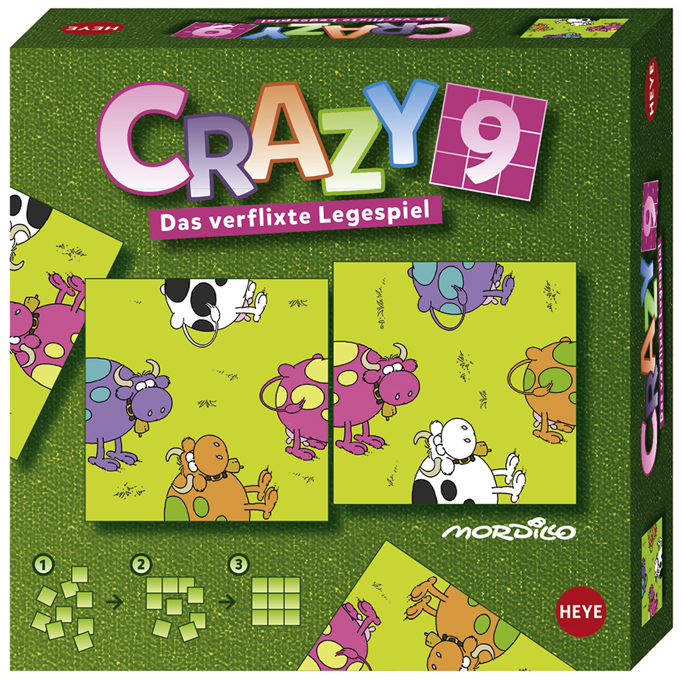

# crazy-9-solver

A solver for the Heye crazy 9 card game (https://heye-puzzle.de/en/kategorie/crazy9-en/).



This one solves the cow version of the game but it can be adapted to solve other variations as well.
The solver is horribly inefficient (it was for fun) as it tries all possible combinations till a solution is found.

Running this takes approximately 4 hours on my laptop  the solution is generated earlier but I wanted to find all solutions so it runs till the bitter end.
I did a quick threaded version but as python is single-threaded this was not faster so instead you can set SKIP and start multiple instances.

The result:

```
python solve.py
Solution
['LR', 'RR', 'LH', 'GH'] ['GH', 'VR', 'LR', 'RH'] ['RH', 'VR', 'GR', 'VH']
['LR', 'GR', 'VH', 'RH'] ['LH', 'VR', 'RR', 'GH'] ['GH', 'LR', 'RR', 'VH']
['VR', 'GR', 'LH', 'RH'] ['RH', 'LR', 'VR', 'GH'] ['RH', 'VR', 'GR', 'LH']
Trying 100010 of 362880 26.110022/s
Trying 200020 of 362880 26.137143/s
Trying 300030 of 362880 24.763012/s
Found 1 solutions from 3571099890 combinations in 254 seconds.
```
